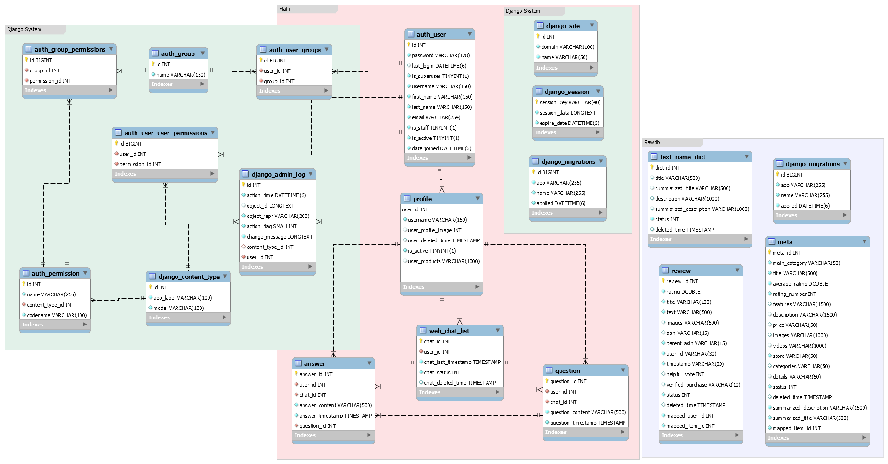

# 🌟 SKN02-FINAL-4Team
**SKN 2기 최종 단위 프로젝트**

---

## 👩‍🏫 팀 소개

- **진정현(팀장)**: 기획, 모델 구조 변경
- **서종호**: 데이터 전처리 및 모델 학습, 백엔드 구조 개선
- **사재민**: 모델 학습, 프론트 엔드 및 백엔드 기능 구현
- **장정원**: 데이터 분석 및 백엔드 기능 구현 

---

## 📈 프로젝트 개요

### 주제
 LLM활용 대화형 상품 추천 시스템

### 프로젝트 목적  
본 프로젝트의 목표는 사용자와의 대화를 통해 개인 맞춤형 상품을 추천하는 시스템을 개발하는 것입니다. 최신 CF와 LLM을 활용하는 기반 모델을 사용하여 사용자에게 더 알맞은 추천을 할 수 있는 모델을 대화형으로 개발 하는 것입니다.

### 기술적 접근

 - **최신 논문 기반 모델 구조**: 최신 연구 논문에서 제안된 CF와 LLM을 활용하는 모델을 사용하여 기존 모델 대비 정확도와 추천 품질을 향상시켰습니다.  
    **논문 링크**: [An Efficient All-round LLM-based Recommender System](https://arxiv.org/abs/2404.11343)   
- **고도화된 추천 알고리즘**: 새로운 모델 구조를 도입하여 사용자 구매이력을 LLM이 더 잘 이해하고 더 정확한 추천을 가능하게합니다. 
- **적은 비용으로 높은 성과** : 미리 학습된 CF와 LLM을 활용하여 적은 비용으로도 높은 성과를 낼 수 있습니다. 

### 주요 기능
- **대화형 인터페이스**: 사용자가 간단한 대화를 통해 상품을 추천받을 수 있는 기능을 제공합니다.
- **맞춤형 추천 알고리즘**: 사용자의 입력을 분석하여 선호도에 맞는 상품을 추천하는 AI 알고리즘을 사용합니다.
- **사용자 경험 개선**: 소비자가 필요한 상품을 빠르게 찾을 수 있어 쇼핑의 편리성이 향상됩니다.
- **개인화된 추천**: 사용자 개개인의 취향에 맞춘 추천으로 만족도를 높이고 재방문율을 향상시킬 수 있습니다.  

### 기대 효과
- **향상된 추천 품질**: 최신 모델을 활용하여 사용자가 필요한 상품을 더욱 정확하게 추천할 수 있습니다.  
- **사용자 만족도 제고**: 개인화된 상품 추천으로 사용자의 만족도가 높아지고 재방문율이 향상될 것으로 기대됩니다.  

---

## 👩‍🏫 서비스 목표

### 구체적인 서비스 목표
**정교한 맞춤형 추천 제공**: 사용자 데이터와 행동 패턴을 바탕으로 사용자가 선호할 만한 콘텐츠와 상품을 정확하게 예측하고 추천합니다.

**추천 효율성 강화**: 최신 머신러닝 모델을 사용하여 추천 정확도를 높이고 사용자가 불필요한 검색 과정 없이 필요한 정보를 더 쉽게 찾을 수 있도록 합니다.
### 기대 효과
**사용자 만족도 증가**: 개인화된 추천을 통해 사용자가 필요로 하는 콘텐츠와 상품을 빠르게 찾도록 하여 사용 경험을 개선하고 만족도를 높입니다. 

**검색 시간 단축**: 필요한 콘텐츠나 상품을 빠르게 추천하여 사용자의 검색 시간을 단축하고 플랫폼 내에서의 사용 효율성을 높입니다.

**플랫폼 참여도와 재방문율 향상**: 맞춤형 추천을 통해 사용자와 플랫폼 간의 관계를 강화하고 재방문율을 높여 장기적인 사용자 관계를 형성할 수 있습니다.

**수익성 증대**: 높은 추천 품질로 인해 사용자 구매 전환율이 높아져 플랫폼의 수익성 개선에 기여합니다.

---

## 🛠️ 기술 스택

---

## 📝 WBS

---

## ✅ 요구사항 명세서

---

## 💻 DB 테이블 - ERD 

---

## 📸 프로젝트 데모

구글 드라이브 링크 입니다 : 
https://drive.google.com/file/d/1w8QONA5JI0j08FFRpvFIjsGAkRKU4RPw/view?usp=drive_link  
paper폴더의 시연영상 zip 과 같은 파일입니다.

---

## 📚 주요 프로시저

---

##  ✅ 모델 성능 평가
hitrate@1표  

**최고 점수** : 2024-11-06-2nd, 0.27

---

## 📚 한줄 회고

- **진정현**: 2달은 길다면 긴시간이 었지만 진행해보니 짧게 느껴졌었다. 논문을 바탕으로 진행하는 것도 꽤 재밌다는 것을 알게 되었고 생각보다 재밌게 진행한 것 같다.
- **서종호**: 
- **사재민**: 첫 장기 프로젝트를 진행하면서 더 많은 것을 시도하고 배울 수 있는 기회가 되었다. 스스로 성장함을 느낄 수 있었고, 팀원과 함께였기 때문에 부족함을 채우고 성공적으로 프로젝트를 마칠 수 있었다.
- **장정원**: 

